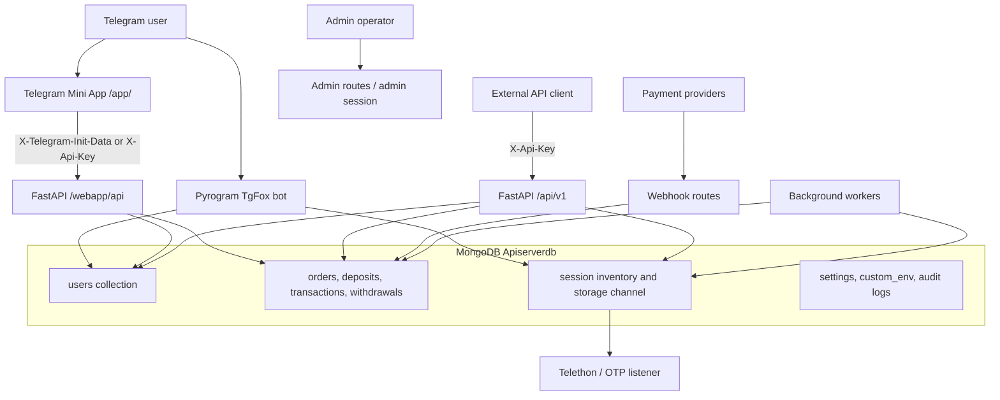

# TgFoxApi Architecture

## Runtime Topology



## Startup Sequence

| Order | Component | Responsibility |
|---|---|---|
| 1 | Bootstrap | Reads Mongo-backed custom environment values before importing configuration |
| 2 | MongoDB | Reinitializes Motor inside the active asyncio loop |
| 3 | Session cleanup | Removes stale local temporary Telethon session material |
| 4 | Memory store | Loads settings, countries, proxies, sudoers, bans, and stock summaries |
| 5 | Plugin loader | Imports bot plugin modules |
| 6 | FastAPI | Starts API in same event loop and waits for TCP availability |
| 7 | Pyrogram bot | Authenticates bot and verifies Telegram storage channel access |
| 8 | Mini App | Registers `WEBAPP_URL` as Telegram menu button when configured |
| 9 | Workers | Starts payment, timeout, stock, withdrawal, cleanup, and feed services |

## Identity Model

The canonical account key is `users.user_id`, a Telegram numeric user ID. The bot assigns/updates this record on `/start`; public API keys reference the same record. The original Mini App design verifies Telegram `initData` server-side. The current fallback path accepts an existing API key, maps it to the same canonical `user_id`, and sends it only in an HTTP header during the current browser session.

## Data Boundaries

| Boundary | Data intentionally withheld from client responses |
|---|---|
| Session inventory | Raw stored session files, storage-channel references, encrypted session/password material |
| Payments | Provider credentials, private callback signing data, raw gateway metadata |
| Orders | OTP/password values are owner-scoped and only exposed via delivery state |
| Seller data | Session credentials and sensitive seller review material |
| Admin | Internal task/log/settings data behind admin session dependency |

## Deployment Contract

The native deployment uses one build command to compile the Mini App and one runtime command to operate the combined service:

```text
Build: bash build_miniapp.sh && pip install -r requirements.txt
Run:   python3 -m server
```

The FastAPI process serves compiled Mini App files at `/app/`. `WEBAPP_BASE_URL` must be the public HTTPS service origin without `/app/`; configuration derives the final menu URL.

## Operational Dependencies

The platform depends on Telegram bot APIs, MongoDB, payment providers, optional Binance/OxaPay integration, and Telegram channel storage. Availability of each external boundary should be reported through explicit health/readiness instrumentation before production scale-up.
